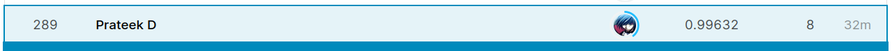

# MNIST-High-Accuracy

## What

The MNIST dataset is a large dataset of handwritten digits that is commonly used for various tasks in training and testing in the field of machine learning. One of these tasks is to identify these digits (0 through 9). We use a CNN for this. A Convolutional Neural Network (CNN) is a Deep Learning algorithm which takes an input image, assigns importance (learnable weights and biases) to various aspects/objects in it and be able to differentiate one from the other. 

## Why

I have used CNNs for this task because the pre-processing required is much lower as compared to other classification algorithms. While in primitive methods filters are hand-engineered, with enough training, CNNs have the ability to learn these filters.

## How

After standardizing the data, I created a CNN model with 8 Conv2D layers with Batch Normalization and Dropout layers at appropriate places. I didn't use Max Pooling because it seemed to give inferior results. For extra training data, we used ImageDataGenerator and only used rotation, zoom and shift. For the learning rate (LR), I used a callback called ReduceLROnPlateau. It reduces the LR by a constant number (called factor) when a metric (validation accuracy in our case) has stopped improving for some number of epochs (called the patience).

## Results

After 30 epochs of training (~9 minutes), we achieved a validation accuracy of 99.45% and testing accuracy of 99.63% as can be seen below. 

After analyzing the confusion matrix and seeing the misidentified samples, we see that the model predicts 1 → 7, 4 → 9 and 9 → 8 in extremely rare cases. This can happen beacuse the handwritings of all the above corresponding pairs can sometimes be similar.